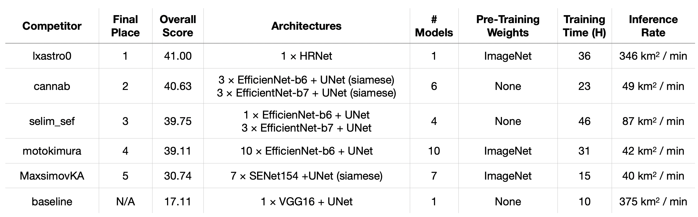
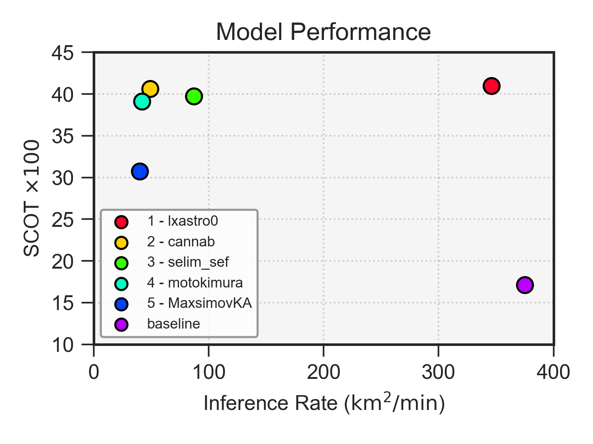

<p align="center">
<a href="https://spacenet.ai"></a>
</p>
<h1 align="center">The SpaceNet 7 Multi-temporal Urban Development Challenge </h1>
<h2 align="center">Winning Solutions</h2>
<br>

## Summary

The five subdirectories in this repository comprise the code for the winning solutions of SpaceNet 7 hosted by TopCoder. Each subdirectory contains the competitors' written descriptions of their solution to the challenge. See the blog post on CosmiQ Works' blog [The DownlinQ](?) for an additional summary.  Baseline code can be found [here](https://github.com/CosmiQ/CosmiQ_SN7_Baseline).

Data is hosted on aws at:
```
	s3://spacenet-dataset/spacenet/SN7_buildings/
```

Winning model weights are hosted at:
```
	s3://spacenet-dataset/spacenet-model-weights/spacenet-7/
```

The winning solutions all use Docker, and assume SpaceNet 7 data is mounted in the `/data/` directory.  

Performance of the algorithms on the SpaceNet 7 final test set is shown below:





---------

Questions about SpaceNet? Check out our website at [https://spacenet.ai](https://spacenet.ai).


